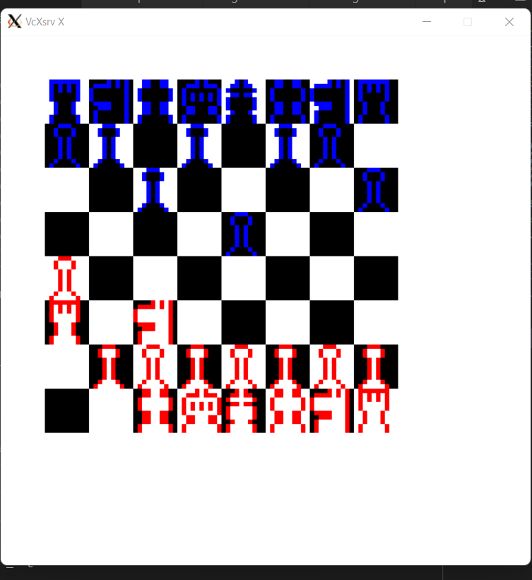

# chess_game
This is the final project for CS24. For this project, I have:
•	Collaborated with a team to develop a multi-level chess game by using C++, Linux for command line purpose, X11 as image rendering tool and UML diagram for project planning
•	Applied Objected Oriented Programming (OOP) concepts with Observer design pattern for developing game features and utilized shared pointer for memory management

For this project demo, please contact me at: k4tieu@uwaterloo.ca

